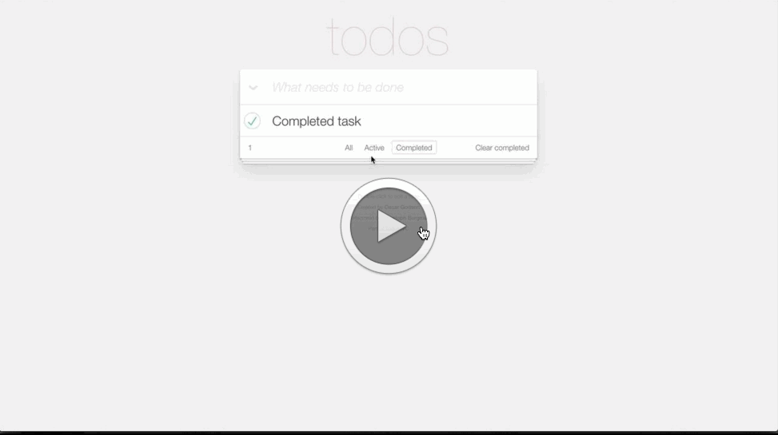

ReactJS bindings in OCaml
=========================

These are my bindings to ReactJS, by my count this is the global sixth
attempt at binding to React and my own second attempt, its kind of
hard.

Installation
============

Right now you can install with:

```shell
$ opam install reactjs
```

To get the development version, do:

```shell
$ opam pin add -y reactjs git@github.com:fxfactorial/ocaml-reactjs.git
```

The bindings should work on `node` or in the browser, both will assume
that `React`, and `ReactDOM` exist (on node they will do the
appropriate `require`, node side will also try to load the npm package
`react-dom`)

Documentation
=============

See this blog [post](http://hyegar.com/2016/07/17/js-of-ocaml-usage/)
to get a better understanding of OCaml typing of JavaScript objects
and such, (explains the `##` syntax extension).

The `mli` is commented and the doc strings should come up for you with
`merlin`. I also recommend using `ocp-browser`, this is a program that
is installed via `opam install ocp-index` and it gives you a nice high
level way to see the API: 


You can also do: `make doc` in the repo, that will create a directory
called `api.docdir` and in there you open the `index.html` for pretty
generated documentation.

If you're okay with doing: `brew cask install wkhtmltopdf`, then you
can get a PDF generated from the OCaml documentation. do 

```shell
$ make generate_pdf
```

And then the `reactjs_bindings.pdf` will be built in the root of the
directory. It should look like:


Contributing
============

Contributions of any kind are appreciated. If you're updating this
readme, then be update `static/README_base.markdown` and then run
`make readme`. 

For the source code itself, be aware that it uses some more advanced
features of the type system and can be mental pain. I haven't exposed
everything of `React` yet, and the library can still be made more
strongly typed. 

Right now a `JSX` like ppx is needed since writing out the `Text`,
`Elem` variants can be more strain on the brain and `JSX` lets you see
the structure of the element you're making more easily.

Before opening a PR, be sure to test all the existing examples. You
can build them all at once from the `reactjs_based_examples` directory
with `make all_examples`, or `make -C reactjs_based_examples
all_examples` from the root directory.

More examples added are always appreciated and you can do it by:

```shell
$ cd reactjs_based_examples
$ cp -R basic your_new_example
```

and add your example's directory name to the `Makefile`'s `dirs`
variable in the root of the project, 

around line 40s, `dirs := basic basic-click-counter quadratic`.

Examples
========

These examples should be familiar and are autogenerated into this
README from under the `reactjs_based_examples` dir.

Check the wiki for common FAQs, compile any example with:

```shell
$ ocamlfind ocamlc -package reactjs -linkpkg code.ml
$ js_of_ocaml a.out -o code.js
```

Also see
[ocaml-mailing-list](https://github.com/fxfactorial/ocaml-mailing-list)
for more example source code, include how to render on the server with
`nodejs`.


[//]: # "Do not write anything below here, the code examples will be appended"


# reactjs_based_examples/basic

```ocaml
let example_application = Reactjs.(
    make_class_spec
      ~initial_state:(fun ~this ->
          print_endline "Initial state called";
          object%js end
        )
      ~default_props:(fun ~this ->
          print_endline "Default props called";
          object%js end
        )
      ~component_will_mount:(fun ~this -> print_endline "Component will mount")
      ~component_did_mount:(fun ~this -> print_endline "Component did mount")
      ~component_will_receive_props:(fun ~this ~next_prop ->
          print_endline "Component will receive props"
        )
      ~should_component_update:(fun ~this ~next_prop ~next_state ->
          print_endline "Should component update called";
          Js.bool true
        )
      ~component_will_update:(fun ~this ~next_prop ~next_state ->
          print_endline "Component will update"
        )
      ~component_did_update:(fun ~this ~prev_prop ~prev_state ->
          print_endline "Component did update"
        )
      ~component_will_unmount:(fun ~this -> print_endline "Component about to unmount")
      (fun ~this ->
         let elapsed = Js.math##round this##.props##.elapsed /. 100.0 in
         let seconds = elapsed /. 10.0 in
         let message = Printf.sprintf
             "React has been successfully running for %f seconds" seconds
         in
         DOM.make ~tag:`p [Text message]
      )
    |> create_class
  )

let _ = Reactjs.(
    let example_app_factory = create_factory example_application in
    let start = (new%js Js.date_now)##getTime in
    set_interval
      ~f:(fun () ->
          try
            let react_elem = example_app_factory ~props:(object%js
                val elapsed = (new%js Js.date_now)##getTime -. start
              end)
            in
            render ~react_elem (get_elem ~id:"container")
          (* Get OCaml exception handling! *)
          with Js.Error e ->
            Firebug.console##log e
        ) ~every:100.0
  )
```


# reactjs_based_examples/basic-click-counter

```ocaml
let counter = Reactjs.(
    make_class_spec
      ~initial_state:(fun ~this -> (object%js val count = 0 end))
      ~component_will_mount:(fun ~this ->
          print_endline "Component about to mount"
        )
      (fun ~this -> let open Reactjs.Infix in
        let handle_click = !@(fun () ->
            this##setState (object%js val count = this##.state##.count + 1 end))
        in
         DOM.make
           ~elem_spec:(object%js
             val onClick = handle_click
           end)
           ~tag:`button
           [Text (Printf.sprintf
                    "Click me, number of clicks: %d" this##.state##.count)])
    |> create_class
  )

let () = Reactjs.(
    render
      ~react_elem:(create_element_from_class counter)
      (get_elem ~id:"container")
  )
```


# reactjs_based_examples/quadratic

```ocaml
open StdLabels

let quadratic_calculator = Reactjs.(
    make_class_spec
      ~initial_state:(fun ~this -> object%js
                       val a = 1.0 val b = 3.0 val c = -3.0
                     end)
      (fun ~this -> let open Infix in
        let handle_input_change =
          fun ~key event ->
            let new_state =
              ([(key,
                 event##.target##.value |> Js.parseFloat |> Js.number_of_float )] >>>
               object%js end)
            in
            this##setState new_state
        in
        let (a, b, c) = this##.state##.a, this##.state##.b, this##.state##.c in
        let root = Js.math##sqrt ((Js.math##pow b 2.0) -. 4.0 *. a *. c) in
        let denominator = 2.0 *. a in
        let (x1, x2) = (-.b +. root) /. denominator, (-.b -. root) /. denominator in
        let input_label ~key init_value = DOM.(
            make ~tag:`label
              [Text (Printf.sprintf "%s: " key);
               Elem (make ~elem_spec:(object%js
                       val type_ = !*"number"
                       val value = !^init_value
                       val onChange = handle_input_change ~key
                     end) ~tag:`input [])]
          )
        in
        let label_row l = l |> List.map ~f:(fun (key, value) ->
            [Elem (input_label ~key value); Elem (DOM.make ~tag:`br [])]
          ) |> List.flatten
        in
        let equation_row = DOM.(
            [Elem (make ~tag:`em [Text "ax"]); Elem (make ~tag:`sup [Text "2"]);
             Text " + "; Elem (make ~tag:`em [Text "bx"]); Text " + ";
             Elem (make ~tag:`em [Text "c"]); Text " = 0"])
        in
        DOM.(make ~tag:`div
               [Elem (make ~tag:`strong equation_row );
                Elem (make ~tag:`h4 [Text "Solve for ";
                                     Elem (make ~tag:`em [Text "x"])]);
                Elem (make ~tag:`p
                        (label_row [("a", a); ("b", b); ("c", c)] @
                         [Text "x: ";
                          Elem (make ~tag:`strong
                                  [Text (Printf.sprintf "%f %f" x1 x2)])]))
               ]))
    |> create_class
  )

let () =
  Reactjs.(render
             ~react_elem:(create_element_from_class quadratic_calculator)
             (get_elem ~id:"container"))
```



# reactjs_based_examples/todomvc

```ocaml
type task_id = int

type task =
  {
    id: task_id;
    label: string;
    completed: bool;
  }

type tab = All | Active | Completed
  
type state = {
  editing: task_id option;
  tasks: task list;
  tab: tab;
}

type history =
  state list

let initial_state =
  let tasks = [{id = 0;
                label = "Initial task";
                completed = false};
               {id = 1;
                label = "Completed task";
                completed = true};
               {id = 2;
                label = "Final task";
                completed = true};]
  in
  ref {editing = None;
       tasks = tasks;
       tab = All}

let (histories : history ref) =
  ref []

let observe _old_state new_state =
  Printf.printf "Mutation observed: %d\n" (List.length new_state.tasks)
  
let observer =
  ref (fun _old_state _new_state -> Printf.printf "Placeholder observer used")
           
let swap (ref : state ref) f =
  let old_state = !ref in
  ref := f ref;
  let new_state = !ref in
  ignore(!observer old_state new_state);
  histories := List.append [new_state] !histories;
  Printf.printf "History count: %d\n" (List.length !histories);
  ()

let set_tab state tab =
  {state with tab = tab}

let random_el arr =
    let n = Random.int (Array.length arr) in
    Array.get arr n;;

let colors =
  [|"blue"; "green"; "pink"; "purple"; "white"; "gray"|]

let random_color () =
  random_el colors

let todo_item (task : task) =
  let open Reactjs in
  let open Infix in
  make_class_spec
    (fun ~this ->
       ignore(this);
       DOM.make ~tag:`li
         ~elem_spec:(object%js
           val key = !*("li-todo-input-" ^ (string_of_int task.id))
       end)
         (if (match !initial_state.editing with
              | None -> false
              | Some id -> id = task.id) then
            [Elem (DOM.make ~tag:`input ~elem_spec:(object%js
                     val key = !*("todo-input-" ^ (string_of_int task.id))
                     val type_ = !*"text"
                     val style = (object%js val display = "block" val backgroundColor = !*("white") end)
                     val defaultValue = task.label
                     val onChange = (fun event ->
                         this##setState event##.target##.value |> Js.to_string
                         (* swap initial_state (fun state -> *)
                         (* let new_tasks = List.map (fun t -> *)
                         (*     if t.id = task.id then *)
                         (*       {t with label = event##.target##.value |> Js.to_string } *)
                         (*     else *)
                         (*       t) !state.tasks in *)
                         (* {!state with tasks = new_tasks}) *))
                     val onKeyUp = (fun event ->
                         Printf.printf "Key: %d\n" event##.which;
                         match event##.which with
                         | 13 -> swap initial_state (fun state -> 
                         let new_tasks = List.map (fun t ->
                             if t.id = task.id then
                               {t with label = event##.target##.value |> Js.to_string }
                             else
                               t) !state.tasks in
                           let _tt = List.find (fun t -> t.id = task.id) new_tasks in
                           Printf.printf "Task label after updating: %s\n" _tt.label;
                           {!state with 
                            tasks = new_tasks;
                            editing = None})
                         | 27 -> swap initial_state (fun state -> {!state with editing = None})
                         | _ ->  () 

                       )
                     val className = Js.string "edit"
                   end)
                     [])]
          else 
            [Elem (DOM.make 
                     ~tag:`div
                     ~elem_spec:(object%js
                       val className = "view"
                       val onDoubleClick = (fun _ -> swap initial_state (fun state ->
                           Printf.printf "Now editing %d\n"task.id;
                           {!state with editing = Some task.id}
                         ))
                     end)
                     [Elem (DOM.make ~tag:`input ~elem_spec:(object%js
                              val type_ = !*"checkbox"
                              val onClick = (fun _ -> swap initial_state (fun state ->
                                  let new_tasks = List.map (fun t -> 
                                      if t.id = task.id then
                                        {t with completed = not t.completed}
                                      else
                                        t
                                    ) !state.tasks in
                                  {!state with tasks = new_tasks}
                                ))
                              val checked = Js.string (if task.completed then "checked" else "")
                              val className = Js.string "toggle"
                            end)
                              []);
                      Elem (DOM.make 
                              ~tag:`label
                              [Text ((match !initial_state.editing with
                                   | None -> ""
                                   | Some editing -> if editing = task.id then "Editing: " else "") ^  task.label);]);
                      Elem (DOM.make 
                              ~tag:`button
                              ~elem_spec:(object%js
                                val onClick = (fun _ -> swap initial_state (fun state ->
                                    let new_tasks = List.filter (fun t -> 
                                        t.id != task.id
                                      ) !state.tasks in
                                    {!state with tasks = new_tasks}
                                  ))
                                val className = !*"destroy"
                              end)
                              [])])]))
  |> create_class

let todo_input () =
  let open Reactjs in
  let open Infix in
  make_class_spec
    (fun ~this ->
       ignore(this);
       DOM.make ~tag:`input
         ~elem_spec:(object%js
           val className = !*"new-todo"
           val placeholder = !*"What needs to be done"
           val autofocus = !*"true"
           val onKeyDown = (fun event ->
               match event##.which with
               | 13 -> swap initial_state (fun state ->
                   let id = Random.int 64000 in
                   Printf.printf "Updating new task...\n";
                   Firebug.console##log event##.target##.value;
                   let new_tasks = List.append !state.tasks [{id = id; label = event##.target##.value |> Js.to_string; completed = false}] in
                   Printf.printf "New tasks updated\n";
                   {!state with tasks = new_tasks}
                 )
               | _ -> ())

         end)
         [])
  |> create_class

let root app =
  let open Reactjs in
  let open Infix in
  let tasks = List.filter (fun task ->
      Printf.printf "Checking if task matches: %d\n" task.id;
      match app.tab with
      | All -> true
      | Active -> not task.completed
      | Completed -> task.completed
    ) app.tasks in
  make_class_spec
    (fun ~this ->
       ignore(this);
       DOM.make ~tag:`section
         ~elem_spec:(object%js
           val className = !*"todoapp"
         end)
         [Elem (DOM.make ~tag:`header
                  ~elem_spec:(object%js
                    val className = !*"header"
                  end)
                  [Elem (DOM.make ~tag:`h1 [Text "todos"]);
                   Elem (create_element_from_class (todo_input ()))]);
          Elem (DOM.make ~tag:`section
                  ~elem_spec:(object%js
                    val className = !*"main"
                  end) [Elem (DOM.make ~tag:`input
                                ~elem_spec:([("type", Js.string "checkbox");
                                             ("className", Js.string "toggle-all")]
                                            >>> object%js end) []);
                        Elem (DOM.make ~tag:`label
                                ~elem_spec:([("htmlFor", Js.string "toggle-all");]
                                            >>> object%js end)
                                [Text "Mark all as complete"]);
                        Elem (DOM.make ~tag:`ul
                                ~elem_spec:(object%js
                                  val className = !*"todo-list"
                                end)
                                (List.map (fun task -> Elem (create_element_from_class (todo_item task))) tasks))]);
          Elem (DOM.make ~tag:`footer
                  ~elem_spec:(object%js
                    val className = !*"footer"
                  end)
                  [Elem (DOM.make ~tag:`span ~elem_spec:(object%js
                           val className = !*"todo-count"
                         end) [Text (string_of_int (List.length tasks))]);
                   Elem (DOM.make ~tag:`ul ~elem_spec:(object%js
                           val className = !*"filters"
                         end) 
                           [Elem (DOM.make ~tag:`li [Elem (DOM.make ~tag:`a ~elem_spec:(object%js
                                                             val href = !*"#/"
                                                             val onClick = (fun _ -> swap initial_state (fun state -> set_tab !state All))
                                                             val className = (match app.tab with
                                                                 | All -> !*"selected"
                                                                 | _ -> !*"")
                                                           end) [Text "All"])]);
                            Elem (DOM.make ~tag:`li [Elem (DOM.make ~tag:`a ~elem_spec:(object%js
                                                             val href = !*"#/active"
                                                             val onClick = (fun _ -> swap initial_state (fun state -> set_tab !state Active))
                                                             val className = (match app.tab with
                                                                 | Active -> !*"selected"
                                                                 | _ -> !*"")
                                                           end) [Text "Active"])]);
                            Elem (DOM.make ~tag:`li [Elem (DOM.make ~tag:`a ~elem_spec:(object%js
                                                             val href = !*"#/completed"
                                                             val onClick = (fun _ -> swap initial_state (fun state -> set_tab !state Completed))
                                                             val className = (match app.tab with
                                                                 | Completed -> !*"selected"
                                                                 | _ -> !*"")
                                                           end) [Text "Completed"])])]);
                   Elem (DOM.make ~tag:`button ~elem_spec:(object%js
                           val className = !*"clear-completed"
                           val onClick = (fun _ -> swap initial_state (fun state ->
                               let new_tasks = List.filter (fun t -> 
                                   not t.completed
                                 ) !state.tasks in
                               {!state with tasks = new_tasks}
                             ))
                         end) [Text "Clear completed"])
                  ]);
         ])
  |> create_class

let dump_state _ =
  List.iter (fun task -> print_endline (task.label ^ " [" ^ (string_of_bool task.completed) ^ "]")) !initial_state.tasks

let () =
  Js.Unsafe.global##.dump_state := dump_state

let () =
  Js.Unsafe.global##.get_state := (fun _ -> !initial_state)

let first_render =
  ref true

let wrap_root state_ref =
  let open Reactjs in
  let open Infix in
  make_class_spec
    (fun ~this ->
       ignore(this);
       DOM.make ~tag:`div
         ~elem_spec:(object%js
           val className = !*"overreact"
         end)
         [Elem (create_element_from_class (root !state_ref));
         ])
  |> create_class

let render_root state =
  let open Reactjs in
  (match !state.tab with
   | All -> Printf.printf "Current tab: All\n"
   | Active -> Printf.printf "Current tab: Active\n"
   | Completed -> Printf.printf "Current tab: Completed\n");
  (match !first_render with
   | _ -> let root_el_ = render
                 ~react_elem:(create_element_from_class (wrap_root state))
                 (get_elem ~id:"container") in
     first_render := false;
     Js.Unsafe.global##.example := root_el_;
   (* | false -> Js.Unsafe.global##.example##forceUpdate *)
  );
  Firebug.console##log Js.Unsafe.global##.example;
  ()

let replay_history =
  (fun _ ->
      let rec render_next_state = (fun states ->
          match (List.length states) with
          | 0 -> ()
          | _ -> let next_state = List.hd states in
            render_root (ref next_state);
            ignore(Dom_html.window##setTimeout (Js.wrap_callback (fun () -> render_next_state (List.tl states); ())) 500.);
        ()) in
      render_next_state (List.rev !histories)
    )

let () =
  Js.Unsafe.global##.replayHistory := replay_history;
  let app_observer = (fun (_old_state : state) (_new_state : state) -> render_root initial_state) in
  observer := app_observer;
  swap initial_state (fun state -> state := {!state with tab = All}; !state);
```
