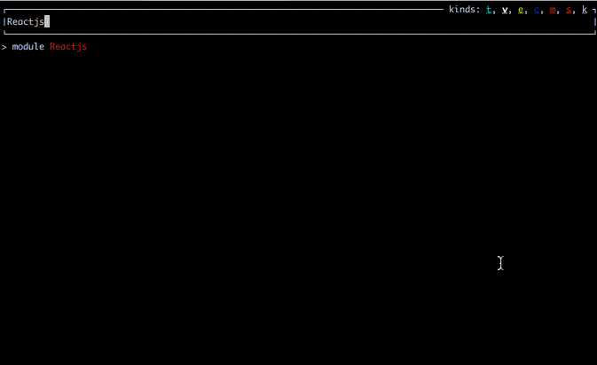
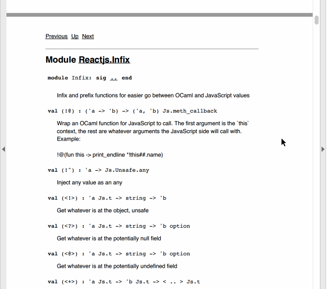
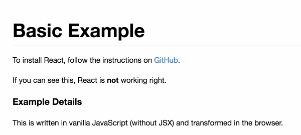
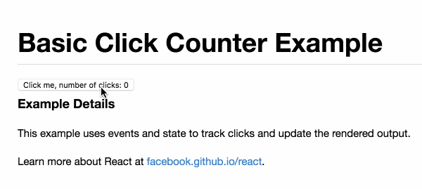
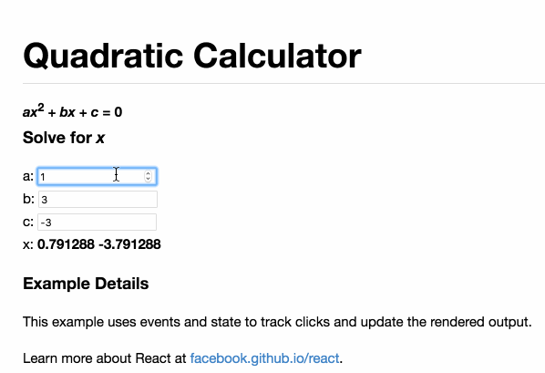

ReactJS bindings in OCaml
=========================

These are my bindings to ReactJS, by my count this is the global sixth
attempt at binding to React and my own second attempt, its kind of
hard.

Installation
============

Right now you can install with:

```shell
$ opam install reactjs
```

To get the development version, do:

```shell
$ opam pin add -y reactjs https://github.com/fxfactorial/ocaml-reactjs
```

The bindings should work on `node` or in the browser, both will assume
that `React`, and `ReactDOM` exist (on node they will do the
appropriate `require`, node side will also try to load the npm package
`react-dom`)

Documentation
=============

See this blog [post](http://hyegar.com/2016/07/17/js-of-ocaml-usage/)
to get a better understanding of OCaml typing of JavaScript objects
and such, (explains the `##` syntax extension).

The `mli` is commented and the doc strings should come up for you with
`merlin`. I also recommend using `ocp-browser`, this is a program that
is installed via `opam install ocp-index` and it gives you a nice high
level way to see the API: 



You can also do: `make doc` in the repo, that will create a directory
called `api.docdir` and in there you open the `index.html` for pretty
generated documentation.

If you're okay with doing: `brew cask install wkhtmltopdf`, then you
can get a PDF generated from the OCaml documentation. do 

```shell
$ make generate_pdf
```

And then the `reactjs_bindings.pdf` will be built in the root of the
directory. It should look like:



Contributing
============

Contributions of any kind are appreciated. If you're updating this
readme, then be update `static/README_base.markdown` and then run
`make readme`. 

For the source code itself, be aware that it uses some more advanced
features of the type system and can be mental pain. I haven't exposed
everything of `React` yet, and the library can still be made more
strongly typed. 

Right now a `JSX` like ppx is needed since writing out the `Text`,
`Elem` variants can be more strain on the brain and `JSX` lets you see
the structure of the element you're making more easily.

Before opening a PR, be sure to test all the existing examples. You
can build them all at once from the `reactjs_based_examples` directory
with `make all_examples`, or `make -C reactjs_based_examples
all_examples` from the root directory.

More examples added are always appreciated and you can do it by:

```shell
$ cd reactjs_based_examples
$ cp -R basic your_new_example
```

and add your example's directory name to the `Makefile`'s `dirs`
variable in the root of the project, 

around line 40s, `dirs := basic basic-click-counter quadratic`.

Examples
========

These examples should be familiar and are autogenerated into this
README from under the `reactjs_based_examples` dir.

Check the wiki for common FAQs, compile any example with:

```shell
$ ocamlfind ocamlc -package reactjs -linkpkg code.ml
$ js_of_ocaml a.out -o code.js
```

Also see
[ocaml-mailing-list](https://github.com/fxfactorial/ocaml-mailing-list)
for more example source code, include how to render on the server with
`nodejs`.


[//]: # "Do not write anything below here, the code examples will be appended"



# reactjs_based_examples/basic

```ocaml
let example_application = Reactjs.(
    make_class_spec
      ~initial_state:(fun ~this ->
          print_endline "Initial state called";
          object%js end
        )
      ~default_props:(fun ~this ->
          print_endline "Default props called";
          object%js end
        )
      ~component_will_mount:(fun ~this -> print_endline "Component will mount")
      ~component_did_mount:(fun ~this -> print_endline "Component did mount")
      ~component_will_receive_props:(fun ~this ~next_prop ->
          print_endline "Component will receive props"
        )
      ~should_component_update:(fun ~this ~next_prop ~next_state ->
          print_endline "Should component update called";
          Js.bool true
        )
      ~component_will_update:(fun ~this ~next_prop ~next_state ->
          print_endline "Component will update"
        )
      ~component_did_update:(fun ~this ~prev_prop ~prev_state ->
          print_endline "Component did update"
        )
      ~component_will_unmount:(fun ~this -> print_endline "Component about to unmount")
      (fun ~this ->
         let elapsed = Js.math##round this##.props##.elapsed /. 100.0 in
         let seconds = elapsed /. 10.0 in
         let message = Printf.sprintf
             "React has been successfully running for %f seconds" seconds
         in
         DOM.make ~tag:`p [Text message]
      )
    |> create_class
  )

let _ = Reactjs.(
    let example_app_factory = create_factory example_application in
    let start = (new%js Js.date_now)##getTime in
    set_interval
      ~f:(fun () ->
          try
            let react_elem = example_app_factory ~props:(object%js
                val elapsed = (new%js Js.date_now)##getTime -. start
              end)
            in
            render ~react_elem (get_elem ~id:"container")
          (* Get OCaml exception handling! *)
          with Js.Error e ->
            Firebug.console##log e
        ) ~every:100.0
  )
```



# reactjs_based_examples/basic-click-counter

```ocaml
let counter = Reactjs.(
    make_class_spec
      ~initial_state:(fun ~this -> (object%js val count = 0 end))
      ~component_will_mount:(fun ~this ->
          print_endline "Component about to mount"
        )
      (fun ~this -> let open Reactjs.Infix in
        let handle_click = !@(fun () ->
            this##setState (object%js val count = this##.state##.count + 1 end))
        in
         DOM.make
           ~elem_spec:(object%js
             val onClick = handle_click
           end)
           ~tag:`button
           [Text (Printf.sprintf
                    "Click me, number of clicks: %d" this##.state##.count)])
    |> create_class
  )

let () = Reactjs.(
    render
      ~react_elem:(create_element_from_class counter)
      (get_elem ~id:"container")
  )
```



# reactjs_based_examples/quadratic

```ocaml
open StdLabels

let quadratic_calculator = Reactjs.(
    make_class_spec
      ~initial_state:(fun ~this -> object%js
                       val a = 1.0 val b = 3.0 val c = -3.0
                     end)
      (fun ~this -> let open Infix in
        let handle_input_change =
          fun ~key event ->
            let new_state =
              ([(key,
                 event##.target##.value |> Js.parseFloat |> Js.number_of_float )] >>>
               object%js end)
            in
            this##setState new_state
        in
        let (a, b, c) = this##.state##.a, this##.state##.b, this##.state##.c in
        let root = Js.math##sqrt ((Js.math##pow b 2.0) -. 4.0 *. a *. c) in
        let denominator = 2.0 *. a in
        let (x1, x2) = (-.b +. root) /. denominator, (-.b -. root) /. denominator in
        let input_label ~key init_value = DOM.(
            make ~tag:`label
              [Text (Printf.sprintf "%s: " key);
               Elem (make ~elem_spec:(object%js
                       val type_ = !*"number"
                       val value = !^init_value
                       val onChange = handle_input_change ~key
                     end) ~tag:`input [])]
          )
        in
        let label_row l = l |> List.map ~f:(fun (key, value) ->
            [Elem (input_label ~key value); Elem (DOM.make ~tag:`br [])]
          ) |> List.flatten
        in
        let equation_row = DOM.(
            [Elem (make ~tag:`em [Text "ax"]); Elem (make ~tag:`sup [Text "2"]);
             Text " + "; Elem (make ~tag:`em [Text "bx"]); Text " + ";
             Elem (make ~tag:`em [Text "c"]); Text " = 0"])
        in
        DOM.(make ~tag:`div
               [Elem (make ~tag:`strong equation_row );
                Elem (make ~tag:`h4 [Text "Solve for ";
                                     Elem (make ~tag:`em [Text "x"])]);
                Elem (make ~tag:`p
                        (label_row [("a", a); ("b", b); ("c", c)] @
                         [Text "x: ";
                          Elem (make ~tag:`strong
                                  [Text (Printf.sprintf "%f %f" x1 x2)])]))
               ]))
    |> create_class
  )

let () =
  Reactjs.(render
             ~react_elem:(create_element_from_class quadratic_calculator)
             (get_elem ~id:"container"))
```
